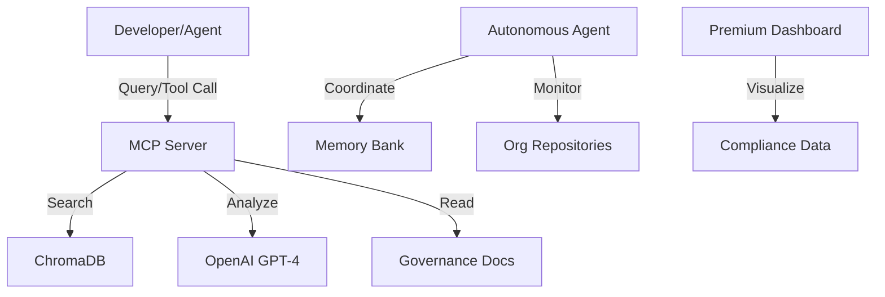

# Project Completion Report: Organizational Governance

## Executive Summary

The **Organizational Governance** project has been successfully completed, delivering a comprehensive, AI-driven governance framework for the Mallow-Dev organization. The system is now fully operational, featuring a centralized repository of standards, a multi-agent coordination infrastructure, an intelligent MCP server, and a premium compliance dashboard.

## Deliverables by Phase

### Phase 1: Foundation ✅

- **Centralized Repository**: `org-governance` established as the single source of truth.
- **Standards & Policies**: Defined Git branching, code markers, and AI agent approval policies.
- **Workflow Automation**: Implemented branch protection synchronization and pre-commit hooks.
- **Memory Bank**: Established the "Memory Bank" pattern for project context preservation.

### Phase 2: Intelligence & Search ✅

- **Semantic Search**: Integrated LangChain + ChromaDB into the MCP server for natural language querying of governance docs.
- **Premium Dashboard**: Built a Next.js/Tailwind dashboard with a "Premium" dark theme to visualize compliance metrics.
- **Multi-Agent Infrastructure**: Defined roles (Governance Monitor, Report Processor, etc.) and coordination protocols (`AGENTS.md`) for autonomous agents.
- **Agent Integration**: Demonstrated programmatic agent interaction with the MCP server.

### Phase 3: Advanced Capabilities ✅

- **Automated Reporting**: Implemented a reporting engine to generate compliance summaries.
- **Proactive Recommendations**: Deployed an LLM-based recommendation engine to suggest policy improvements.
- **Adoption Kit**: Created `onboard-repo.sh` and `adoption-guide.md` to facilitate org-wide rollout.

## System Architecture

## Key Artifacts

- **Repository**: `Mallow-Dev/org-governance`
- **MCP Server**: `mcp-server/` (Python/FastAPI)
- **Dashboard**: `dashboard/` (Next.js)
- **Documentation**: `standards/`, `policies/`, `workflows/`
- **Scripts**: `scripts/` (Automation & Tooling)

## Next Steps for Organization

1.  **Deploy MCP Server**: Host the `mcp-server` on internal infrastructure (e.g., Kubernetes or a VM) to make it accessible to all agents.
2.  **Activate Agents**: Deploy the 4 defined autonomous agents using the `mallow-agents` framework (or equivalent).
3.  **Onboard Repositories**: Run `./scripts/onboard-repo.sh` on all active projects to enforce standards.
4.  **Monitor & Iterate**: Use the dashboard to track compliance trends and refine policies based on the recommendation engine's output.

---

**Status**: Project Complete 🚀
**Date**: 2025-11-25
