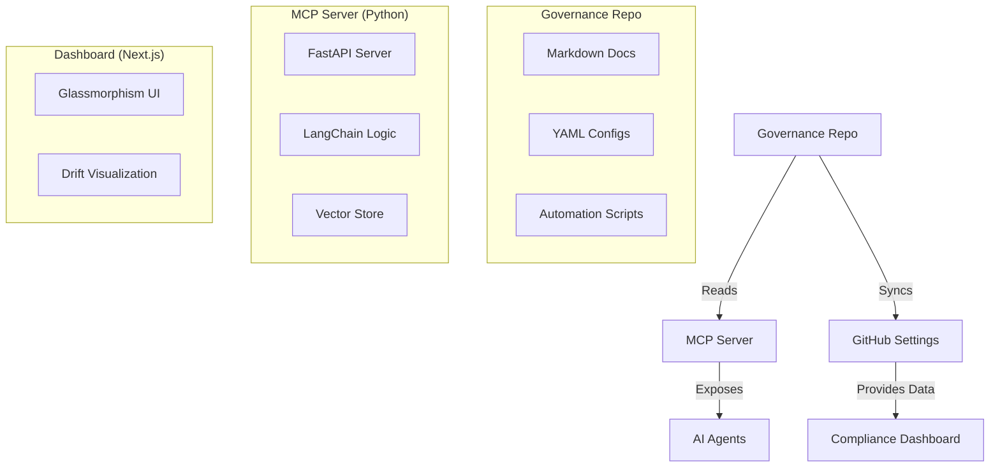

# System Context

## Architecture

## Tech Stack

- **Repository**: Git, Markdown, YAML.
- **MCP Server**: Python 3.10+, FastAPI, LangChain, ChromaDB.
- **Dashboard**: Next.js 14, Tailwind CSS, Framer Motion.
- **Automation**: TypeScript (Octokit), GitHub Actions.

## Key Workflows

1. **Policy Update**: Dev submits PR -> 3-way Vote -> Merge -> MCP Server updates index.
2. **Agent Query**: Agent asks "How do I commit?" -> MCP searches docs -> Returns `conventional-commits` rule.
3. **Drift Detection**: Scheduled Action checks GitHub settings vs YAML -> Updates Dashboard -> Alerts Tech Lead.
